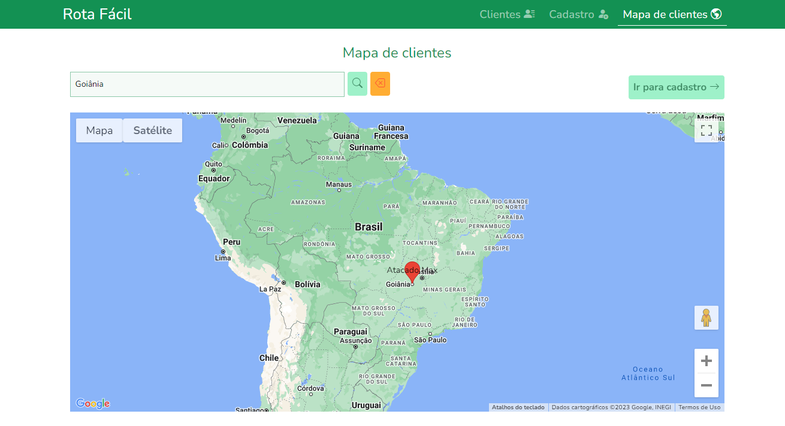

<h1>Rota Fácil</h1>

<p>O sistema Rota Fácil é uma aplicação desenvolvida para gerenciar o cadastro de clientes e endereços. Através do sistema, é possível cadastrar novos clientes e seus respectivos endereços, vinculando-os geograficamente.</p>

<h2>Funcionalidades</h2>

<h4>1. Cadastro de clientes</h4>
<p>O cadastro de clientes é uma das principais funcionalidades do sistema, e para garantir a qualidade dos dados cadastrados, são aplicadas as seguintes regras de negócio:</p>
<ul>

<li>O sistema permite o cadastro de clientes com nome , CNPJ e endereço com localização geográfica;</li>

<li>O sistema não permite o cadastro de um cliente sem nome, CNPJ e endereço com localização;</li>

<li>O cadastro de endereço inclui localização geográfica;</li>

<li>Validação de CEP por meio da API do ViaCep;</li>

<li>Busca das referências de latitude e longitude por meio da API do Google Maps.</li>

</ul>


> Na tela acima, é possível realizar o cadastro de um cliente contando com validação de CEP por meio da API do ViaCep e obtenção da latitude e longitude do cliente por meio da API do Google Maps e sua exibição.

<h4>2. Visualização de clientes no mapa</h4>
<p>A funcionalidade de visualização de clientes no mapa permite que os usuários do sistema possam ver a localização dos clientes cadastrados. Para garantir a efetividade dessa funcionalidade, são aplicadas as seguintes regras de negócio:</p>
<ul>

<li>O sistema permite a visualização dos clientes cadastrados em um mapa utilizando a API do Google Maps.</li>

</ul>


> A tela acima exibe os clientes de forma listada, oferecendo opções para edição, exclusão e visualização da localização do cliente no mapa.


> A imagem acima ilustra a exibição da localização do cliente selecionado com informações mais detalhadas sobre a sua localização.


> A tela acima se trata da exibição de todos os clientes cadastrados em um mapa com marcações em vermelho e o nome do cliente.



> A imagem acima demonstra a utilização da ferramenta de filtro para trazer somente clientes que possuem alguma ocorrência do filtro informado em seus endereços.

<h4>3. Requisitos não funcionais</h4>
<p>Alguns dos requisitos não funcionais que o sistema possui são:</p>
<ul>

<li>Performance: o sistema possui boa performance e responde rapidamente às consultas;</li>

<li>Usabilidade: o sistema é de fácil utilização e navegação;</li>

<li>Escalabilidade: o sistema é escalável, permitindo o cadastro de um grande número de clientes e endereços.</li>

</ul>

<h2>Instruções de uso</h2>

<h3>Pré-requisitos</h3>
<p>Antes de começar, verifique se você atendeu aos seguintes requisitos:</p>
<ul>

<li>Java SE Development Kit 17</li>
<li>Angular 15.2.7</li>
<li>Node 18.12.1</li>
<li>NPM 8.19.2</li>
<li>Angular CLI 15.1.6</li>

</ul>

<p>Observação: para exibição dos mapas é necessário ter a chave para a API do Google Maps. Para isso, acesse o site: https://developers.google.com/maps/documentation/javascript/get-api-key
</p>

<p>Após a obtenção da chave é necessário configurar alguns arquivos. Abra o seguinte arquivo para ver um exemplo dessa configuração: </p>

```
frontend/src/environments/environment_example.ts
```

<p>Para usar o cadastro de clientes, siga estas etapas:</p>
<p>Clone o repositório</p>

```
git clone https://github.com/gabrielsmm/rota-facil.git
```

<h4>Frontend</h4>
<p>Acesse a pasta da aplicação e instale as dependências:</p>

```
cd frontend
npm install
```

<p>Inicie a aplicação:</p>

```
ng serve
```

<h4>Backend</h4>
<p>Para execução da API é recomendado o uso de alguma das IDE's abaixo:</p>
<ul>

<li>IDE IntelliJ</li>
<li>Spring Tools Suite</li>
<li>Netbeans</li>
<li>Eclipse</li>

</ul>

<h2>Tecnologias Utilizadas</h2>
<h3>Backend</h3>
<ul>

<li>IDE IntelliJ</li>

<li>Java 17</li>

<li>Maven</li>

<li>Framework Spring</li>

<li>Spring Boot</li>

<li>Spring Web</li>

<li>Spring Data JPA</li>

<li>Postman</li>

<li>Swagger</li>

<li>H2Database</li>

<li>Lombok</li>

<li>PostgreSQL</li>

</ul>

<h3>Frontend</h3>

<ul>

<li>Angular 15+</li>

<li>Reactive Forms</li>

<li>Material</li>

<li>Bootstrap</li>

<li>Integração com Google Maps</li>

<li>Integração com ViaCep</li>

</ul>